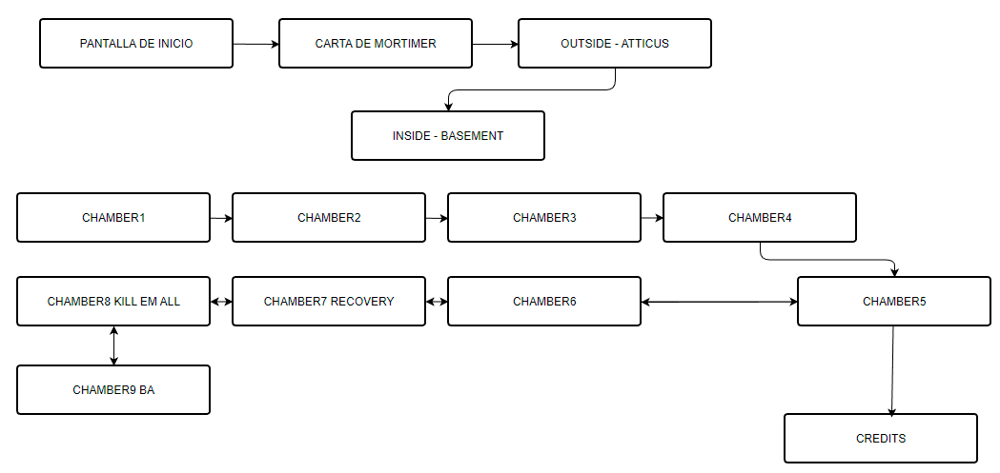
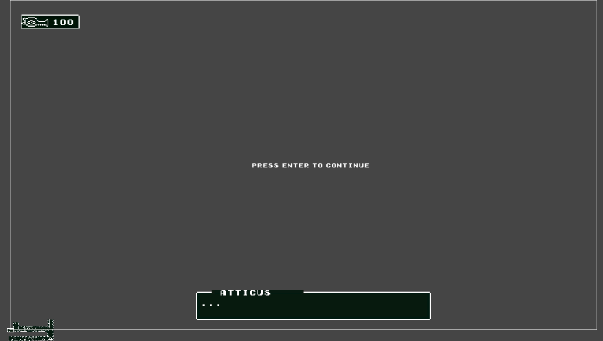
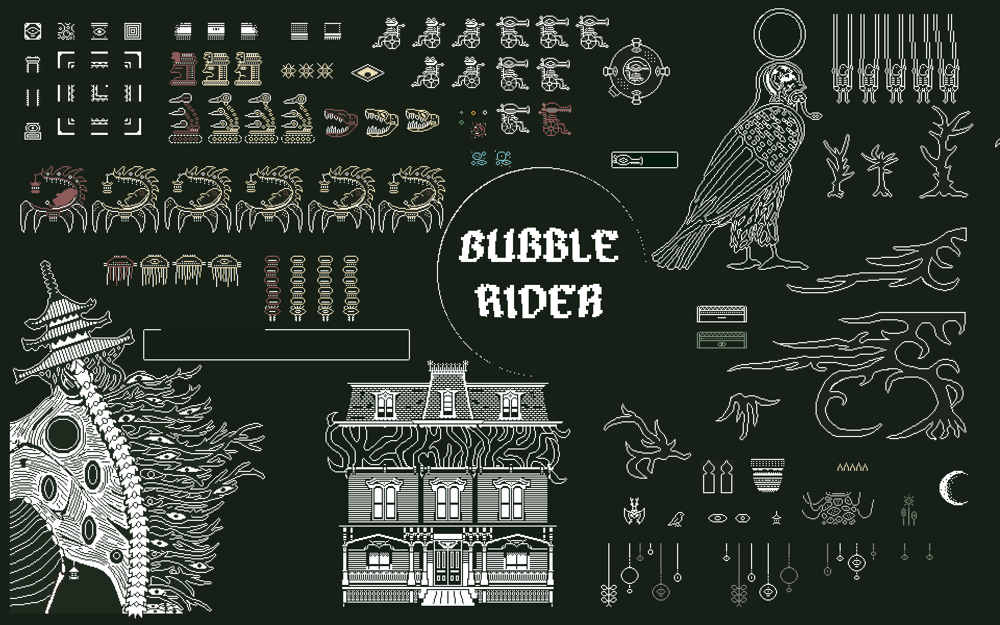

# BUBBLE RIDER

## GAME DESIGN DOCUMENT

Creado por: Martina Castelo Pérez

Versión del documento: < 2.0 >

## HISTORIAL DE REVISIONES

| Versión | Fecha | Comentarios |
| --- | --- | --- |
| 1.00 | 18-04-2023 | Creación del documento |
| 2.00 | 15-05-2023 | Finalización del documento |

## RESUMEN

### Concepto

Embárcate en una emocionante aventura postapocalíptica junto a Hop, una sapita decidida a seguir los pasos de su abuelo Mortimer, un gran viajero e inventor. Hop encuentra una carta que su abuelo le escribió antes de fallecer donde la anima a emprender el mismo viaje que a él le cambió la vida, cuando descubrió un misterioso santuario al que creía que iría después de su muerte. Con la ayuda de la máscara de burbujas especiales diseñada por su abuelo, Hop se adentra en un mundo lleno de secretos y peligros, donde las burbujas no sólo la protegen, sino que también le permiten explorar nuevos lugares y descubrir tesoros ocultos que la llevarán al santuario y así encontrarse de nuevo con él. A lo largo del camino, encuentra aliados y se enfrenta a enemigos en su misión de honrar la memoria de su abuelo y vivir su propia experiencia de viaje alucinante.

### Puntos Clave

1. __Aventura postapocalíptica__: Explora un mundo nuevo después del apocalipsis, lleno de peligros y misterios que debes descubrir.

2. __*Bubble Mask*__: Usa una máscara de burbujas diseñada por Mortimer para explorar y protegerte de los peligros que te rodean. También puedes usarla como medio de transporte para moverte por el mundo del juego, ya que podrás interactuar con diversas estructuras de los escenarios para generar diferentes tipos de burbujas e introducirte dentro de ellas, desafiando la gravedad y resolviendo puzzles espaciales. 

3. __Fragmentos de llave__: Busca los fragmentos de llave escondidos en el mundo del juego para encontrar el santuario y reunirte con Mortimer.

4. __Secretos y tesoros__: Descubre los secretos y tesoros ocultos que dejó Mortimer en su viaje, y que te ayudarán a avanzar en tu aventura y mejorar tus habilidades, así como diversos coleccionables que enriquecerán tu experiencia de juego. 

5. __Aliados y enemigos__: Conoce nuevos personajes y aliados en tu aventura, pero también enfrenta a peligrosos enemigos y criaturas hostiles que intentarán detenerte en tu camino y que tendrás que abatirlos con tu máscara disparadora de burbujas. 

6. __Historia emocionante__: Vive una historia conmovedora sobre el amor incondicional entre un abuelo y su nieta, que traspasa los límites del tiempo y el espacio. 

### Género

El género de este juego se corresponde con un Metroidvania, es decir, un juego de aventuras/acción con plataformas y, en este caso, el componente shooter, así como puzzle espacial. 

### Público Objetivo

Jugador o jugadora con cierta experiencia y no tan *casual*, especialmente en genéro metroidvania y/o plataformas, con preferencia por juegos *indie* o incluso arcade. En concreto, podríamos hablar de un segmento entre 25 y 45 años. Esto es debido a que los juegos con estética 2D 1-bit tipo *Game Boy* o similares cuentan con un componente de nostalgia con la que pueden empatizar más fácilmente jugadores/as que hayan vivido esas generaciones.

El jugador o jugadora de *Bubble Rider* en general disfruta otros títulos como por ejemplo la saga *Metroid, The Legend of Zelda, Hollow Knight, Gato Roboto, Ori and the Blind Forest, Axiom Verge, Owlboy...*

### Experiencia de Juego

En el juego, el jugador experimentará una combinación de elementos de Metroidvania, plataformas y shooter en un entorno 2D. Al empezar el juego, el jugador se encontrará en un mundo semiabierto donde tendrá acceso al subsuelo, donde ocurrirá el grueso del juego. Los jugadores pueden avanzar en la historia por las plataformas y destruyendo enemigos, así como encontrándose con aliados que le proporcionarán nuevas habilidades y elementos necesarios para avanzar en el juego. 

El juego contará con gráficos 2D de pixel art one-bit, así como música variada y efectos de sonido adecuados para el universo donde se desarrolla. En concreto, el jugador podrá avanzar, saltar, disparar... todo ello en un entorno estético cohesivo y una atmósfera absorbente.  En resumen, el jugador experimentará una emocionante aventura de plataformas y acción en un mundo único en su narrativa y estética. 

## DISEÑO

### Metas de Diseño

- Exploración: permitir al jugador explorar un mundo interconectado y descubrir nuevas áreas, secretos y objetos. conseguir que el jugador se meta por completo en el universo del juego, descubriendo nuevas áreas, cada una con elementos diferenciativos tanto a nivel estético como de mecánicas, y vaya descubriendo poco a poco las mejoras y aumentando su compromiso con la partida. Con la estética se busca que el jugador tenga una sensación de *trip*, con la estética surrealista y onírica. 

- Historia: conectar al jugador con las emociones relativas a la historia contada. Se trata de una historia muy humana y emotiva, por lo que puede aumentar la empatía con el jugador y aumentar la conexión con el universo presentado.

- Mejoras y crecimiento: proporcionar al jugador sensación de progreso y de fácil (pero desafiante) aprendizaje, evitar la frustración derivada tanto de aspectos técnicos como de diseño de niveles y, sobre todo, evitar la monotonía. 

- Combate: proporcionar una experiencia de combate emocionante y desafiante para el jugador, que incluya diferentes tipos de enemigos, cada uno con sus características y patrones de ataque y movimiento. Introducir poco a poco los enemigos creando una curva de aprendizaje progresiva. 

- Inmersión: como ya se ha destacado, crear un mundo cohesivo y bien diseñado que haga sentir al jugador que está realmente en ese universo ficticio y que todo tiene sentido dentro de la lógica del juego.

- Interconexión: hacer que el mundo del juego esté interconectado de manera que el jugador tenga que volver a áreas previamente exploradas con nuevas habilidades y herramientas para descubrir más secretos y avanzar en la trama principal, como es propio en el género metroidvania. 

- Economía de recursos: encontrar el equilibrio entre la economía de recursos estéticos, para fomentar la cohesión, y la variedad, para evitar la sensación de que siempre es lo mismo. 

## MECÁNICAS DE JUEGO

### Núcleo de Juego

El núcleo de Bubble Rider se basa en la habilidad del jugador para saltar, correr y disparar abatiendo enemigos a lo largo de los diferentes niveles que se presentan. Los controles son básicos y fáciles de aprender. 

El propósito general, al margen de la historia en sí, es mantenerse con vida e ir adquiriendo nuevas tecnologías y/o habilidades, ya que, según avance el juego, también se complicarán las mecánicas, sobre todo las espaciales. 

Las mecánicas principales son el desafío espacial mediante plataformas y, por otro lado, el componente shooter para acabar con los enemigos. Vamos a desglosar cada una de estas partes:

1. Plataformas: El jugador podrá avanzar por el mundo del juego por sus diferentes superficies. En este mundo existe la gravedad, por lo que se avanzará sobre terrenos y plataformas con posibilidad de caídas a distinto nivel. Para avanzar por las diferentes salas, habrá que valerse de la habilidad de Hop de saltar y de avance lateral. El diseño de niveles estará pensado para plantear un desafío espacial, en el cual el jugador tendrá que avanzar ya sea lateral o verticalmente a través de todo tipo de plataformas (incluso elementos que, a priori, no parecen plataformas como puede ser el caso de las plataformas orgánicas con forma de ramas) y esquivar fosos de pinchos u otras sustancias nocivas. Además, durante este avance, el jugador tendrá que coordinar el componente de salto y plataformeo con el abatir a los enemigos mediante disparos. 
En muchas ocasiones, el jugador no verá en primera instancia la magnitud de la sala donde se encuentra, ya que tendrá que avanzar para ir descubriendo sus obstáculos y los peligros que alberga. 
Además, en lo referente al concepto espacial del mundo del juego, en el tramo final de la demo se añade una nueva característica que cambia por completo las mecánicas del juego: el Bubbleler. En posteriores niveles, la idea del Bubbleler es que Hop pueda activarlo en diferentes dispositivos habilitados, y con él, poder avanzar por diferentes salas por las que no es posible hacerlo rodando. Precisamente, a nivel narrativo esto tiene mucho peso, ya que se trata de que todas las tecnologías que se van incluyendo faciliten la inserción de Hop en las mecánicas de juego con su silla de ruedas. 
Algunos obstáculos requieren un timing preciso para ser superados, mientras que otros pueden ser evitados mediante habilidad y estrategia.

 En lo que se refiere a las reglas en la parte de plataformas, podemos resumirlo en:
 - Se trata de avanzar y superar obstáculos mediante saltos o avances laterales. 
 - Evitar la caída a fosos u otros peligros, que disminuirán la vida del jugador. 
 - Emplear las plataformas para acceder a lugares o incluso para abatir a otros enemigos. 
 - Activar los diferentes triggers o interruptores que haya sobre el terreno para propiciar el avance.

2. Shooter: este componente está estrechamente ligado con las plataformas. Ambas mecánicas se funden para aumentar el desafío y la complejidad del juego. 
La forma de abatir a los enemigos en el universo de Bubble Rider es mediante armas, en concreto, mediante la Bubble Mask, que dispara burbujas que destruyen a los enemigos y criaturas que el jugador se irá encontrando a lo largo de su aventura. Además, esta mecánica es la empleada también por muchos de los enemigos. En resumen:
- El jugador disparará a los enemigos, con diferentes tipos de burbujas o con nuevas funcionalidades (por ejemplo, el Bubbleler) a sus enemigos con el fin de hacerles daño y aniquilarlos.
- Asimismo, el jugador podrá recibir daño de los enemigos tanto por disparo de los mismos como por colisión con ellos. Cuando el contador de vida sea igual a 0, la partida finalizará. 
- Con el disparo básico, el primero de la BubbleMask y el mostrado en esta demo, no existe un límite de ammo. Con otras mejoras en el futuro, se pretende limitar la cantidad de ammo según la mejora. 

Ambas mecánicas tienen el propósito de llevar al jugador al siguiente punto de la historia, ya sea a conseguir una mejora para poder seguir avanzando, conocer a aliados, abatir a jefes, con el propósito de llegar al final del juego, que es la reunión en el santuario con Mortimer. 

### Flujo de Juego

> *Describe la secuencia del juego durante la partida, en una ejecución normal. Se debe escribir en orden de secuencia, desde el inicio hasta el final de la partida. Debería ser por medio de un diagrama de flujo*

### Fin de Juego

DERROTAS:
- Cuando la vida del jugador alcance la cifra "0". Esto puede ocurrir por diversos motivos:
- El jugador recibe ataques por disparo de los enemigos.
- El jugador recibe daño por colisión (ya sea por una única colisión o por CollisionStay).
- El jugador disminuye su cantidad de vida por entrar en colisión con elementos dañinos del escenario (por ejemplo, fosos con pinchos).
Cuando la vida del jugador sea igual a 0, saltará a la escena de Game Over desde la cual se podrá iniciar un nuevo juego (sin guardar progreso. Se empezará en la escena del sótano) o salir del juego, que se dirigirá a la pantalla de título.

VICTORIAS:
- La demo concluirá cuando el jugador consiga el Bubbleler y alcance la salida del sótano con él. Mientras esto no ocurra, no se podrá concluir la demo de forma victoriosa.

OTROS MOTIVOS:
- Abandono voluntario del jugador. Cerrar el juego supondrá el fin de esa partida. Cuando se vuelva a ejecutar, se empezará desde la pantalla de inicio. 

### Física de Juego

La física en el juego se aplicará en este caso a través de la gravedad y la colisión. Estas características permiten al personaje interactuar sobre el escenario pudiendo saltar, disparar, detenerse o interactuar con otros elementos del entorno. El personaje principal también tendrá la capacidad de disparar, lo que implicará la simulación de la trayectoria de los proyectiles.

En el caso del personaje principal, cuenta con un Capsule Collider2D, mediante el cual se detectarán las colisiones tanto con el terreno como con otros personajes, enemigos y objetos, a excepción de la capa de objetos de decoración (Deco) así como con los diferentes puntos Trigger que pueda haber por el escenario. Cuenta además con un RigidBody2D para regular, entre otras cosas, su capacidad de salto. 

En lo referente al escenario, a grosso modo hay tres tipos de Tilemap: Background, Framing y Platforms. El jugador tiene colisión con los dos últimos(que tienen los componentes de Tilemap Collider y Composite Collider asociados), de forma que no pueda sobrepasar los límites del juego y, además, sobre las plataformas pueda avanzar, saltar, etc. De hecho, sólo se puede saltar si se está sobre el Tilemap de plataformas, de la layer Terrain. 

Existen otro tipo de plataformas, las orgánicas con forma de rama, que tienen las mismas características que las plataformas, ya que también forman parte de la capa Terrain. 

Los disparos entre el jugador y enemigos causarán efecto gracias a los métodos OnTriggerEnter2D, tanto para que el jugador reciba daño como para causarlo, y lo mismo con respecto a los enemigos, que tendrán una física similar a la del personaje principal, con la capacidad de moverse y disparar en algunos casos, así como colliders de tipo Capsule o Polygon. Algunos de estos enemigos son terrestres pero otros son aéreos. Además, sus ataques causarán daño tanto por colisión como por disparo. En concreto, algunos enemigos causan con el método OnCollisionStay mayor daño por colisión: Tankstrich, Zerso, Snake Skull y las Spiked Balls. 

Con respecto al Bubbleler, se aplican unas físicas diferentes. Hasta ahora, nuestro personaje estaba "anclado al suelo" por la gravedad, con un componente de salto por las fuerzas aplicadas. Ahora, con gravedad 0, el Bubbleler puede actuar como una nave y avanzar en diferentes direcciones sin el componente de gravedad, pero ejerciendo también colisiones con el resto de elementos en el escenario, exactamente igual que en el caso de no estar en el Bubbleler. La nave también cuenta con emisión de proyectiles en 4 direcciones diferentes.

Además, junto con la nave se puede observar un sistema de partículas que simula la propulsión del Bubbleler. 

### Controles

Con respecto a Hop, la protagonista, explicaremos los tres estados diferentes:

| Acción | Hop1 | Con BubbleMask | Con Bubbleler |
| --------- | --------- | --------- | --------- |
| Dirección | Arrows | Arrows | Arrows |
| Correr | Arrows left & right| Arrows left & right| No se aplica |
| Saltar | Barra espaciadora | Barra espaciadora | No se aplica |
| Disparar | No se aplica| X | X - derecha, Z - izquierda, S y D arriba y abajo

Con respecto a los menus y diálogos:

| Acción | Control | Comentario | 
| --------- | --------- | --------- 
| Avanzar | Enter | Tanto en dialogos como pantallas |
| Pausar | P | 
| Salir del juego | Esc | 
| Menú salir del juego | Y para aceptar, N para cancelar 

## MUNDO DEL JUEGO

### Descripción General

La sensación del jugador en el universo de Bubble Rider es de estar en un mundo que ha cambiado totalmente tras un apocalipsis, dejando extrañas construcciones más propias de pesadilla y con extrañas criaturas, tanto amigos como enemigos, habitando sus tierras. En la zona más de metroidvania, en el subsuelo, el jugador se enfrentará a un reto espacial y con atmósfera opresiva que dará la sensación de un mundo anterior que ha quedado devastado. El jugador avanzará por estas tierras sorteando obstáculos espaciales, desniveles, y enemigos a los que tendrá que enfrentarse. La idea es embarcarse en el mismo viaje que Mortimer, con la diferencia de que Mortimer vivió unos tiempos que ahora son completamente diferentes para su nieta, y se encontrará con sus viejos aliados, ahora resguardados como pueden en pequeños rincones, protegiéndose de los monstruos y la tempestad. 

### Personajes

Jugables:

- __Hop__: nuestra protagonista, una niña esqueleto con cabeza de sapita en silla de ruedas que se embarca en la misma aventura que su abuelo en su día. Puede desplazarse horizontalmente en su silla y saltar también con ella. Cuando obtiene la BubbleMask, una máscara capacitada para emitir burbujas destructivas, puede, además, disparar. 
Con Hop podemos diferenciar entre tres estados:
    - __Hop sin máscara__, en el inicio del juego. 
    - __Hop con la BubbleMask__, preparada para la acción y con toda la jugabilidad asociada.
    - __Hop en Bubbleler__, la burbuja-nave desde la que puede disparar en cuatro direcciones.

Secundarios:

- __Mortimer__: el abuelo fallecido de Hop. En la demo, no se muestra su apariencia. Fue un gran inventor y aventurero que recorrió el mundo, encontrando por el camino grandes amigos y lugares muy especiales.

- __Atticus__: el vecino de Mortimer en el pueblo. Atticus es un esqueleto con cabeza de cuervo que pasa el día en la entrada de su casa, columpiándose. No se gusta nada el sótano de su casa ya que está lleno de bichos. Era un gran amigo de Mortimer y ayudará a Hop a comenzar su aventura.

- __Ba__: el antiguo sacerdote de uno de los templos que se encontró Mortimer a lo largo de su vida. Mortimer salvó de la ruina su templo, y Ba se lo recompensó de por vida custodiando la tecnología del Bubbleler, que ahora entregará a Hop como deseaba su abuelo. 

Enemigos:

- __Spiked Ball__: una bola de pinchos que se desplaza lateralmente o verticalmente en línea. No se puede abatir, sólo esquivar. Hace daño por colisión, con OnCollisionStay.
- __Skancer__: una oruga/serpiente con un gran ojo que dispara cuando el jugador está en su campo de visión. Provoca daño por disparo y también por proximidad, pero sólo una vez por cada colisión. Para vencerlo, hay que dispararle 5 veces. 
- __Totem__: un tótem ancestral que está disparando continuamente. Es un enemigo robusto pero completamente estático. Necesita 10 impactos para ser abatido. También hace daño por colisión. 
- __Tankstrich__: un tanque con tres cabezas de avestruz, se trata de un enemigo grande y muy pesado pero que no dispara. Su principal forma de hacer daño a Hop es avanzar hacia ella y por OnCollisionStay, acabar con su vida. Necesita 25 impactos para ser abatida. 
- __Medusa__: es un enemigo aéreo que permanece flotando, añadiendo más complejidad espacial. No dispara, provoca daño por colisión. Necesita 5 disparos para ser abatida. 
- __Big Eye__: Un gran ojo observador desde las alturas que está acechando hasta que alguien entra en su campo de visión, que será cuando dispare. Necesita 4 impactos de bala. 
- __Snake Skull__: Una gran cabeza de serpiente que se mueve frenéticamente de un punto a otro, esperando morder. Provoca mucho daño por colisión con OnCollisionStay. Necesita 6 disparos para ser abatido.
- __Zerso__: El único miniboss que veremos en la demo. Es un enemigo arácnido, más grande que el resto y que dispara cuando el jugador está en su campo de visión. Hace mucho daño por colisión, con OnCollisionStay. Necesita 50 disparos para ser abatido. 

### Objetos

- BubbleMask: Se trata del primer objeto que obtiene el jugador. Esta máscara provoca una transición entre el estado inicial del jugador y el segundo estado, donde puede disparar y tiene asociadas otras animaciones. 
- Life Drops: estos objetos proporcional vida a Hop. En concreto, cada uno aporta 10 puntos de vida. Los dejan aleatoriamente algunos enemigos, aquellos que tienen marcado el booleano Drops Life a true.
- Bubbleler: es el último objeto que se consigue en esta demo. Cambia el jugador al estado 3, en el que "pilota" una burbuja con cuatro cañones. 
- Recovery Platform: pone la vida al máximo al interactuar con ella. 
- Pedestal del Bubbleler: activa el Bubbleler. 
Todos estos objetos tienen asociados o bien un OnTriggerEnter2D(como en el caso de life drops) o bien Empty Objects que actuan como triggers de los eventos relacionados con estos objetos. Los Triggers presentes en la parte interactiva del juego son los siguientes:
- DialogueTriggers: todos los triggers que desencadenan los cuadros de diálogo del juego.
- BubbleMask Trigger: cuando se provoca el cambio en el jugador y se obtiene la máscara.
- BubblelerTrigger: activa el bubbleler.
- Triggers de cámaras: triggers en las puertas que provocan los cambios de cámara. 
- Triggers de compuertas: para la sala KillEmAll y la gran compuerta del final.

### Flujo de Pantallas

En total hay 6 escenas en el juego, una de ellas se divide en varias salas (la escena de interiores). Además, cada escena se separa entre sí por un efecto de *fade to black* a modo de transición. 

- __Intro__: Primera pantalla que se encuentra el jugador. Cuenta con el logotipo con el título, varios elementos de diseño que forman parte del juego en general, un sistema de partículas y un texto con un efecto parpadeo y una interpolación de transparencia para iniciar el juego. 

- __Mortimer's Letter__: la siguiente pantalla es una secuencia en la que podremos leer el contenido de la carta que Mortimer deja a Hop. El texto va apareciendo letra a letra, podremos pulsar enter cada vez que finalice un párrafo para que aparezca el siguiente, y todo ello acompañado de un efecto sonoro de máquina de escribir. 

- __Outside__: La primera y única escena de exterior y primera vez que vemos al personaje principal jugable. Hop se encuentra delante de la casa de Mortimer. Podrá avanzar hacia la izquierda para hablar con Atticus y obtener la Bubble Mask.

- __Inside (Basement)__: Esta escena se divide en 9 salas:

    - Una primera sala de carácter introductorio. Incluye todos los elementos gráficos y decorativos que veremos a lo largo de todo el área de juego de la demo.
    - Una sala de plataformas con ascenso y descenso y primeros enemigos
    - Una macro sala de desafio espacial y plataformas con nuevos enemigos
    - Una sala pequeña con presentación de enemigos
    - La sala que será el final de la demo y donde se activará el Bubbleler. Separa todas las anteriores salas del siguiente bloque.
    - Una sala de plataformas y con más y nuevos enemigos.
    - Sala "recovery" previa al desafío
    - Sala "Kill Em All", hay que destruir a todos los enemigos para poder avanzar.
    - Sala de recompensa, con Ba.

Una vez que se llega a Ba, hay que hacer el camino de vuelta hasta la gran sala vertical para coger el Bubbleler y volver a la superficie.

- __Créditos__: escena de créditos del proyecto una vez finaliza la demo.

- __Game Over__: accederemos a esta escena cuando la vida sea igual a 0. Podremos empezar un nuevo juego (desde la segunda escena, es decir, desde el interior) o salir y comenzar desde la pantalla de inicio. 

### HUD

La interfaz se limita a una pequeña caja con la vida actual del jugador y un icono con la BubbleMask. Se ha pretendido hacer una HUD lo más simple posible para evitar la saturación visual con el resto de elementos del juego. 
También forman parte de la HUD los cuadros de diálogo y mensajes de instrucciones.
A continuación se muestra un ejemplo del canvas de la interfaz, donde podremos ver la disposicion habitual de elementos como dialogue box, vida del jugador y otros mensajes:

## ARTE

### Metas de Arte

El estilo artístico empleado es Pixel Art en 2D, principalmente 1-bit, con pequeños toques de color adicional. Se persigue una estética principalmente retro, que recuerde a los primeros juegos de 16 bits, pero que represente fielmente la estética onírica y psicodélica del universo de Bubble Rider. 
Con respecto al escenario, los diferenciaremos entre exterior e interior:
- La escena exterior representa un escenario postapocalíptico pero con esa estética onírica, de pesadilla, además de la psicodelia aplicada con elementos como ojos, ramas, etc. Se busca un ambiente oscuro pero a la vez amigable, que se consigue con la mezcla entre la estética de los escenarios y de los personajes, más amables en su diseño y con un toque "Halloween".
- Las salas del interior buscan una mezcla entre lo onírico y lo orgánico, así como llevar al jugador a otra "época" y una mezcolanza cultural, como se puede apreciar en los arcos de estética árabe o dioses como Ba, de inspiración egipcia. La idea es transmitir un concepto de "Mundo Anterior", ancestral y solemne, pero hoy consumido por la ruina y los monstruos. Este aspecto "ruinoso" lo aportan los elementos orgánicos como las ramas secas y los árboles.

Con respecto a los personajes, en especial a los NPC y a Hop, se busca una estética más amigable y agradable, poco agresiva. Estos personajes tienen en común que todos son esqueletos con máscaras o con cabezas de otros animales, como Atticus y los cuervos, o Hop y los batracios. Sin embargo, los enemigos tienen una estética más monstruosa, menos amigable y más de pesadilla, precisamente para identificarlos mejor como enemigos. 

En lo correspondiente a la paleta de color, es principalmente blanca y verde oscuro, muy contrastada. Los pequeños toques de color se añaden en la decoración para las flores (en verde), o en el caso de los enemigos y ese color ámbar, común a todos, para ser fácilmente identificables por código de color. El daño recibido tanto por Hop como por los enemigos se muestra en rojo, un color habitual para este tipo de situaciones. También se distinguen otros elementos por color, como es el caso de las balas, que varían según enemigos o Hop, así como otros elementos interactivos como la vida, que se muestra en azul (tanto life drops como plataformas de recovery) y otros elementos interactivos a resaltar. 

### Assets de Arte

- Tileset de:
    - Terreno exterior
    - Plataformas y suelo interior
    - Framing
    - Background
    - Columnas

- Sprites de Hop
    - Hop sin máscara:
        - Tres sprites para el idle 
        - Dos sprites para el avance lateral
    - Hop con máscara:
        - Tres sprites para el idle
        - Dos sprites para el avance lateral
        - Un sprite para el salto
        - Un sprite para el daño recibido
    - Bubbleler
        - Un sprite

- Animaciones de Hop:
    - Idle
    - Run
    - Jump (sólo con BubbleMask)
    - Hurt (sólo con BubbleMask)

- Sprites de Atticus
    - Cuatro sprites para la animación del columpio
    Animación de Atticus: Raven_Swing (columpio).

Props exterior:
    - Bubble Mask + animación desplazamiento vertical (flote)
    - Tres imágenes para el parallax del exterior:
        - Fondo de estrellas
        - Fondo de montaña 1
        - Fondo de montaña 2
    - Luna
    - Casa de Mortimer
    - Árboles (4 tipos diferentes)
    - Casa de Atticus
    - Barrera del suelo (posteriormente utilizada como puerta también en el sótano)

Props interior:

    - Ba
    - 2 tipos de ramas decorativas
    - Arcos árabes simple y doble
    - 2 plataformas de ramas
    - Pinchos
    - Flores
    - Conjunto de faroles 1
    - Conjunto de faroles 2
    - Conjunto de faroles 3
    - Conjunto de faroles 4
    - Cuervo
    - Murciélago
    - Farolillo + animación (Lantern)
    - Colmena
    - Vasija
    - Recovery platform + animación
    - Pedestal desactivado
    - Pedestal activado + animación 
    - Ojo1 (2 sprites) + animación
    - Ojo2 (2 sprites) + animación
    - Life drops (dos sprites) + animación

Efectos:

    - Bullet del player (verde)
    - Bullet de enemigo vertical (blanca)
    - Bullet de enemigo horizontal (amarilla)
    - Partícula de burbuja
    - Explosión

Sprites enemigos:

    - Totem : 2 sprites + 1 sprite de daño
    - Tankstrich: 3 sprites + 1 sprite de daño
    - Spiked Ball: 3 sprites
    - Big Eye 1 sprite
    - Medusa: 3 sprites + 1 sprite de daño
    - Skancer: 3 sprites + 1 sprite de daño
    - Zerso: 5 sprites + 1 sprite de daño

    Importante: todos los enemigos tienen cada uno su animación de IDLE y una animación de HURT salvo Big Eye. 

Otros elementos:

    - Recuadro de vida
    - DialogueBox

## AUDIO

### Metas de Audio

En el caso de los efectos de sonido, se busca especialmente una ambientacióm de juego retro o incluso arcade, con sonidos muy sencillos y fácilmente identificables con ese tipo de juegos. No se ha querido abusar de efectos sonoros para evitar la sobreestimulación. Se centra especialmente en los sonidos más significativos para las mecánicas, como las balas y el daño recibido o provocado, o el salto de Hop, ya que en este tipo de juegos es muy habitual incluir este efecto sonoro, que aporta dinamismo. 
Por otra parte, en el exterior apenas hay sonidos. Esto es totalmente intencionado, ya que se pretende plasmar la diferencia de jugabilidad entre ambas zonas, siendo una mucho más relajada que la otra. 
La atmósfera musical, que varía según la escena, intenta transmitir lo que ocurre precisamente en cada una de esas escenas. En la pantalla de intro, se emplea una percusión digital para animar a comenzar la partida. En el exterior, en la aldea, la música es más amigable y relajada. Sin embargo, en el sótano, la atmósfera es más opresiva, y la música ha sido escogida para favorecer ese efecto y la sensación de peligro e incertidumbre. 

### Assets de Audio

- Música

    - Intro: chill_drum_loop
    - Exterior: Gamemusic
    - Interior: alone_atmosphere

Efectos de sonido:

- Hop
    - Salto: jump3
    - Disparo: arcade_shoot
    - Daño: hurt_collision_2

- Enemigos
    - Disparo vertical: silent_shoot
    - Daño: bullet_hit_dirt_8
    - Explosion, destruccion del enemigo: kill_enemy_8bit

- Otros:
    - Cuando se presiona start en la pantalla de inicio: StartGame
    - Plataforma de recuperacion de vida: RecoverLife
    - Life drops: one_beep

## DETALLES TÉCNICOS

### Plataformas Objetivo

Por ahora, el juego sólo estará disponible en Windows.

Requisitos minimos (solo es una estimación):

- Sistema operativo: Windows 7 SP1+ o posterior
- Procesador: Intel Core i3 o equivalente
- RAM: 4 GB de memoria RAM
- Almacenamiento: al menos 200 MB de espacio disponible en el disco duro
- Tarjeta gráfica: tarjeta gráfica con soporte para OpenGL 3.0 o superior
- Resolución de pantalla: 1280x720 o superior

### Herramientas de Desarrollo

Motor del juego: Unity

Scripting: Visual Studio Code

GDD: Visual Studio Code

Herramientas gráficas: Adobe Photoshop, Aseprite
